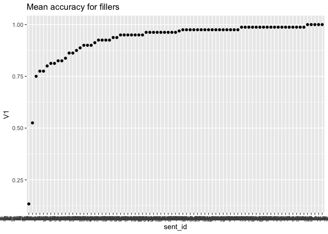
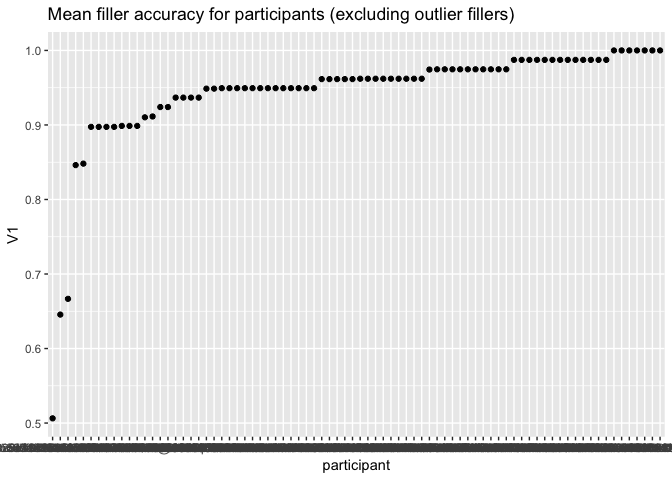
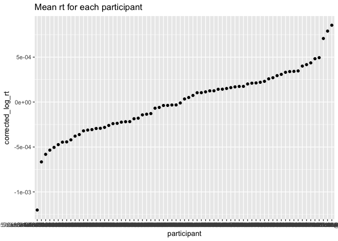
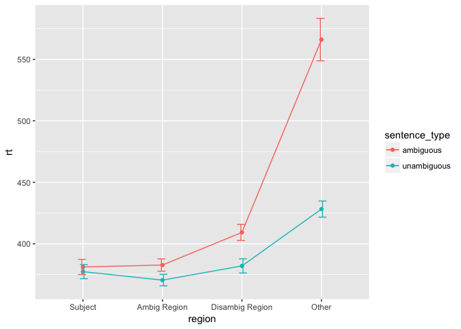
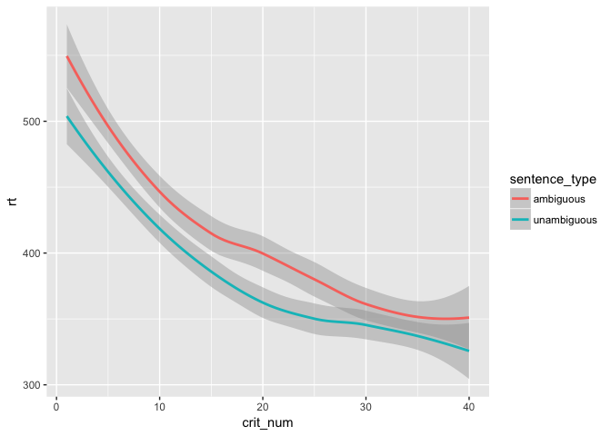
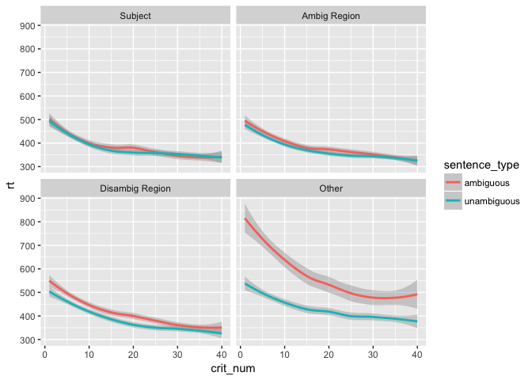
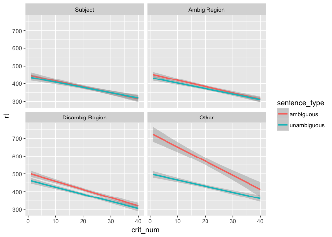

SPR adaptation descriptive plots
================

**Defining functions**

``` r
filter_data <- function(d, filt_var, filt_val){
  m <- mean(d[[filt_var]])
  s <- sd(d[[filt_var]])
  subset(d, d[[filt_var]] > m-(filt_val*s) & d[[filt_var]] < m+(filt_val*s))
}

data_summary <- function(data, varname, groupnames){
  require(plyr)
   length2 <- function (x, na.rm=FALSE) {
        if (na.rm) sum(!is.na(x))
        else       length(x)
    }
  summary_func <- function(x, col){
    c(N    = length2(x[[col]], na.rm=TRUE),
      mean = mean(x[[col]], na.rm=TRUE),
      sd = sd(x[[col]], na.rm=TRUE))
  }
  data_sum<-ddply(data, groupnames, .fun=summary_func,
                  varname)
  data_sum <- rename(data_sum, c("mean" = varname))
  
  data_sum$se <- data_sum$sd / sqrt(data_sum$N)

  ciMult <- qt(0.95/2 + .5, data_sum$N-1)
  data_sum$ci <- data_sum$se * ciMult
 return(data_sum)
}

c. <- function (x) scale(x, scale = FALSE)

plot_regions <- function(d,x_val,y_val,group_val) {
  ggplot(data=d,
       aes_string(x=x_val, y=y_val, colour=group_val, group = group_val)) + geom_point() + geom_line()
}

remove_wrong <- function(d, wrong_df, part) {
  curr_d <- subset(d, d$participant == part)
  curr_wrong <- subset(wrong_df, wrong_df$participant == part)
  bad_sents <- unique(curr_wrong$sentence)
  return(subset(curr_d, !(curr_d$sentence %in% bad_sents)))
}

get_wrong <- function(d, wrong_df, part) {
  curr_d <- subset(d, d$participant == part)
  curr_wrong <- subset(wrong_df, wrong_df$participant == part)
  bad_sents <- unique(curr_wrong$sentence)
  return(subset(curr_d, curr_d$sentence %in% bad_sents))
}
```

``` r
spr_file <- '~/Google Drive/Johns Hopkins/Research/Syntactic adaptation/SynApt/PreExp1/Data/combined_spr.csv'
demographic_file <- '~/Google Drive/Johns Hopkins/Research/Syntactic adaptation/SynApt/PreExp1/Data/combined_demographic.csv'

num_items_perblock <- 16


spr <- read.csv(spr_file, header = T)
demographic <-  read.csv(demographic_file, stringsAsFactors=FALSE)

spr$block <- ceiling((spr$sent_num)/num_items_perblock)
spr$word_length <- nchar(as.character(spr$word))
```

Sanity checks
-------------

Filtering the data
------------------

``` r
## REMOVING NON-NATIVE SPEAKERS

native <- subset(spr, trimws(as.character(participant)) %in% demographic[demographic$firstlang_eng == 'Yes',]$participant)     #converts the participant vector to characters and removes any trailing spaces

length(unique(native$participant))
```

    ## [1] 74

``` r
## FILTERING PARTICIPANTS BY FILLER ACCURACY
unique_fillers <- unique(subset(spr, sentence_type == 'filler')$sent_id)
fillers <- subset(spr, sent_id %in% unique_fillers)

mean_accs_fillers_byitem <- ddply(fillers, .(sent_id), function(x) mean(x$response, na.rm=T)) #for every filler get mean accuracy

mean_accs_fillers_byitem$sent_id <- factor(mean_accs_fillers_byitem$sent_id, levels = unique(mean_accs_fillers_byitem$sent_id[order(mean_accs_fillers_byitem$V1)])) #reordering by accuracy

ggplot(mean_accs_fillers_byitem,aes(x=sent_id, y=V1)) + geom_point() + labs(title = 'Mean accuracy for fillers') #plot accuracy by item
```



``` r
# Get IDs of filler outliers that have accuracy below 2sd
outliers <- unique(subset(mean_accs_fillers_byitem, V1 < mean(mean_accs_fillers_byitem$V1) - (2*sd(mean_accs_fillers_byitem$V1)))$sent_id)
length(outliers)
```

    ## [1] 2

``` r
# Get mean accuracy for each participant excluding the outlier items
mean_accs_fillers_byparticipant <- ddply(subset(fillers, !(sent_id %in% outliers)), .(participant,list), function(x) mean(x$response, na.rm=T))

mean_accs_fillers_byparticipant$participant <- factor(mean_accs_fillers_byparticipant$participant, levels = unique(mean_accs_fillers_byparticipant$participant[order(mean_accs_fillers_byparticipant$V1)])) #reordering by accuracy

ggplot(mean_accs_fillers_byparticipant,aes(x=participant, y=V1)) + geom_point() + labs(title = 'Mean filler accuracy for participants (excluding outlier fillers)') #plot accuracy for each participant
```



``` r
# Excluding participants with low accuracy
accurate <- subset(native, participant %in% mean_accs_fillers_byparticipant[mean_accs_fillers_byparticipant$V1 > 0.8,]$participant)
length(unique(accurate$participant))  #number of participants after excluding participants with low accuracy
```

    ## [1] 71

``` r
## FILTERING TRIALS WITH VERY LONG OR SHORT RTS
accurate$region <- trimws(accurate$region)
accurate$sentence <- trimws(accurate$sentence)
no_questions <- subset(accurate, accurate$region != 'Question')  #we use this because we don't care about RT for questions 
no_outliers <- subset(no_questions, rt > 100 & rt < 2000)
print(nrow(no_outliers))
```

    ## [1] 99916

``` r
(nrow(no_questions) - nrow(no_outliers))*100/nrow(no_questions)  # % outliers excluded
```

    ## [1] 0.4761241

``` r
## FILTERING TRIALS WITH INCORRECT RESPONSES 

all_wrong <- subset(accurate, region == 'Question' & response == 0)
no_wrong <- NULL
wrong <- NULL

for(part in unique(no_outliers$participant)) {
  curr <- remove_wrong(no_outliers,all_wrong,part)
  curr_wrong <- get_wrong(no_outliers, all_wrong, part)
  no_wrong <- rbind(no_wrong,curr)
  wrong <- rbind(wrong, curr_wrong)
}

nrow(wrong)*100/nrow(no_outliers)  
```

    ## [1] 6.112134

``` r
nrow(subset(wrong, sentence_type == 'filler'))*100/ nrow(subset(no_outliers, sentence_type == 'filler'))
```

    ## [1] 4.715595

``` r
nrow(subset(wrong, sentence_type == 'RRC'))*100/ nrow(subset(no_outliers, sentence_type == 'RRC'))
```

    ## [1] NaN

``` r
#replaces unicode char for ',' with a ','
no_wrong$word <- gsub('%2C', ',', no_wrong$word)
no_wrong$sentence <- gsub('%2C', ',', no_wrong$sentence)
no_wrong$word_length <- nchar(no_wrong$word)

## CORRECT FOR EFFECT OF WORD LENGTH

mixed_model <- lmer(log(rt) ~ scale(word_length) + (1+scale(word_length)|participant), no_wrong)
mixed_model_no.outliers <- lmer(log(rt) ~ scale(word_length) + (1+scale(word_length)|participant), no_outliers)
no_wrong$corrected_log_rt <- residuals(mixed_model)

## FILTER PARTICIPANTS WITH VERY SLOW READING TIMES
mean_rt_bypart <- data_summary(no_wrong, 'corrected_log_rt', .(participant))
mean_rt_bypart$participant <- factor(mean_rt_bypart$participant, levels = unique(mean_rt_bypart$participant[order(mean_rt_bypart$corrected_log_rt)]))

ggplot(mean_rt_bypart,aes(x=participant, y=corrected_log_rt)) + geom_point() + labs(title = 'Mean rt for each participant')
```



``` r
slow_parts <- subset(mean_rt_bypart, corrected_log_rt > mean(mean_rt_bypart$corrected_log_rt) + 3*sd(mean_rt_bypart$corrected_log_rt))
length(slow_parts$participant)
```

    ## [1] 0

``` r
no_slow_parts <- subset(no_wrong, !(participant %in% unique(slow_parts$participant)))

length(unique(no_slow_parts$participant))  # number of participants after excluding slow participants
```

    ## [1] 71

Plotting data
-------------

**Getting the right data**

``` r
critical <- subset(no_slow_parts, sentence_type != 'filler')

regions <- c('Subject', 'Ambig Region', 'Disambig Region', 'Other') #modify this based on what you want the x-axis to be
critical$region <-ifelse(critical$sent_pos %in% c(1,2,3), regions[1], 
                                 ifelse(critical$sent_pos %in% c(4,5,6,7), regions[2], 
                                        ifelse(critical$sent_pos %in% c(8,9,10), regions[3], 'Other')))

critical$region <- factor(critical$region, levels = regions) #orders the levels in the order of regions
```

**Plotting garden path effect**

``` r
by_region <- data_summary(critical, 'rt', groupnames = c('region', 'sentence_type')) #replace 'rt' with corrected log rt if you want

ggplot(by_region, aes(region, rt, group = sentence_type, colour = sentence_type)) + geom_point() + geom_line() + geom_errorbar(aes(ymin=rt-ci, ymax=rt+ci), width=.2,position=position_dodge(0.05))
```



**Plotting adaptation**

``` r
#you can also do this with sent_num
by_critnum <- data_summary(critical, 'rt', groupnames = c('crit_num', 'sentence_type', 'region'))

ggplot(subset(by_critnum, region == 'Disambig Region'), aes(crit_num, rt, group = sentence_type, colour = sentence_type)) + geom_smooth() #Plots only disambig region
```

    ## `geom_smooth()` using method = 'loess'



``` r
ggplot(by_critnum, aes(crit_num, rt, group = sentence_type, colour = sentence_type)) +geom_smooth() + facet_wrap(~region)  #Plots all regions "faceted"
```

    ## `geom_smooth()` using method = 'loess'



``` r
ggplot(by_critnum, aes(crit_num, rt, group = sentence_type, colour = sentence_type)) +geom_smooth(method = lm) + facet_wrap(~region)  #use a different smoothing
```


